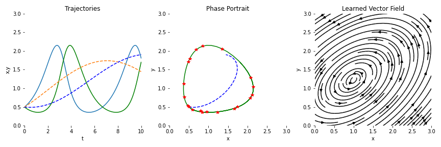
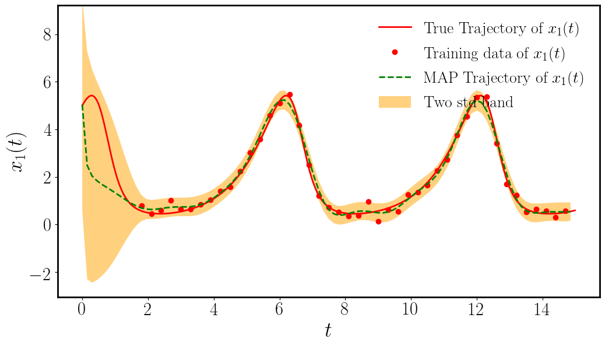
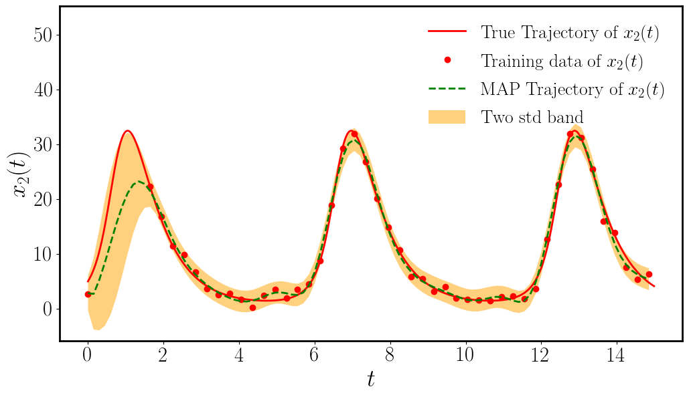
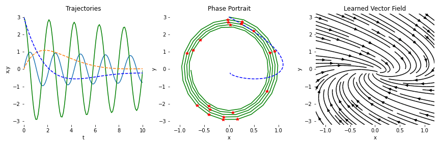

# neuralODEs

This repository includes a collection of "exploration" notebooks on Neural ODEs, based on [`torchdiffeq`](https://github.com/rtqichen/torchdiffeq) and [`GP-NODE`](https://github.com/PredictiveIntelligenceLab/GP-NODEs) packages

## Examples
### Lotka-Volterra
- torchdiffeq

- GP-NODE

### Pendulum
- torchdiffeq

